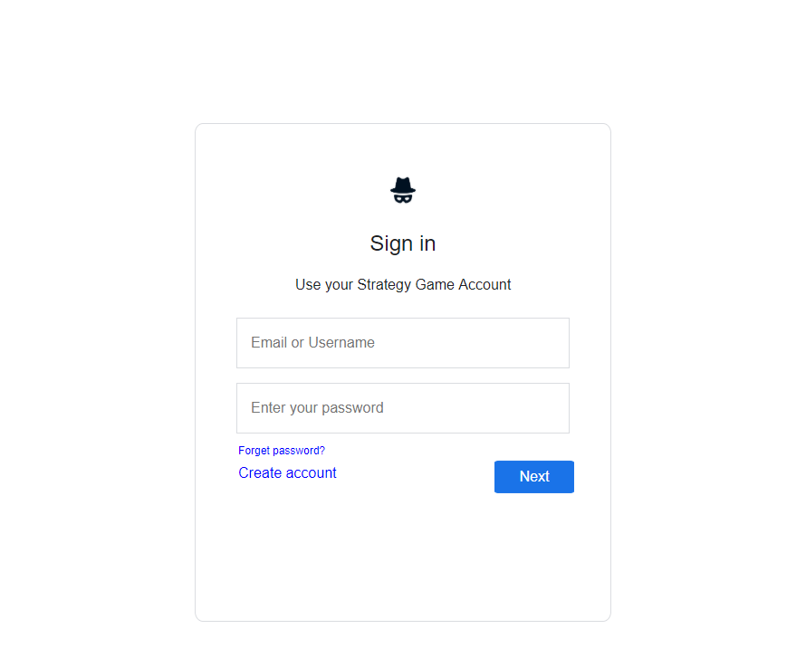

# AStudentLifeCycle

This is Term Project on Software Engineering Course.

The Text Base Strategy Game is about A Software Student Life-Cycle

We focused on student life-cycle which is the Student can work freelance works to earn money and experience. 
The freelance job can make unhappy, tired or unhealthy. The Student will have Power, Happiness, 
Health and Tired bar, So he/she will have a decision mechanism. A student can go home to sleep to relax, 
playing a computer game to get happy or eating some food to recovering the health. When he/she earn money, 
can go to courses to improve knowledge. We will add a banking system to keep the money or interest his/her 
money monthly, or making forex to earn money. The Software student can do hacking but this way is illegal, 
So the police department can find the hacker. The Student can make decisions and these decisions make change his/her life-cycle.

